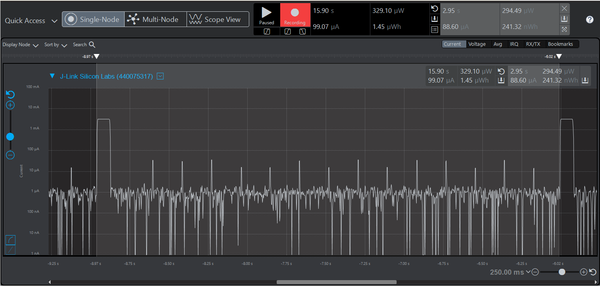
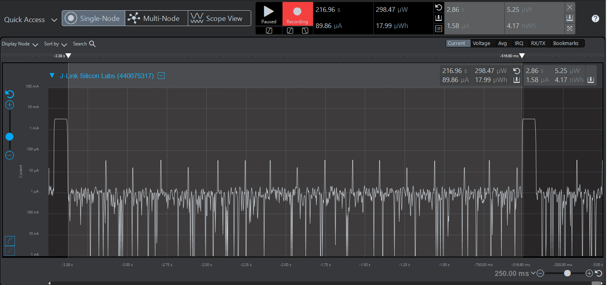
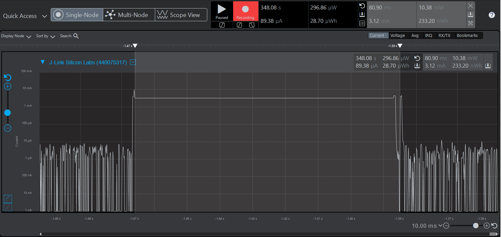
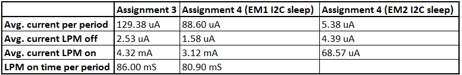

Please include your answers to the questions below with your submission, entering into the space below each question
See [Mastering Markdown](https://guides.github.com/features/mastering-markdown/) for github markdown formatting if desired.

*Be sure to take measurements in the "Default" configuration of the profiler to ensure your logging logic is not impacting current/time measurements.*

*Please include screenshots of the profiler window detailing each current measurement captured.  See [Shared document](https://docs.google.com/document/d/1Ro9G2Nsr_ZXDhBYJ6YyF9CPivb--6UjhHRmVhDGySag/edit?usp=sharing) for instructions.* 

1. What is the average current per period?
   Answer: **88.60uA**
    Screenshot:  
     

2. What is the average current when the Si7021 is Load Power Management OFF?
   Answer: **1.58uA**
    Screenshot:  
     

3. What is the average current when the Si7021 is Load Power Management ON?
   Answer: **3.12mA**
    Screenshot:  
     

4. How long is the Si7021 Load Power Management ON for 1 temperature reading?
   Answer: **80.90 mS**
    Screenshot:  
     

5. What is the total operating time of your design for assignment 4 in hours assuming a 1000mAh supply?
   Answer: Total Operating Time = (Supply)/((Average Current per Period in Amps)*(Number of Periods per hour)) = ((1000)/((88.60*1000)*(2.95/3600)))
   = **13.7735** hours if sleep is **EM1** during I2C transactions. If sleep is **EM2** (deepest sleep possible during I2C), Total Operating Time = ((1000)/((5.38*1000)*(2.96/3600)))
   = **226.8293** hours.
6. How has the power consumption performance of your design changed since the previous assignment?
   Answer: There is a significant change in current consumption due to enabling sleep modes while waiting for power stabilization and I2C transcation completion.
	   This increase in power consumption performance is significantly higher by putting it to sleep in EM2 suring I2C transactions and wait periods.
    Screenshot:  
    
7. Describe how you have tested your code to ensure you are sleeping in EM1 mode during I2C transfers.
   Answer: 1. I have used `SLEEP_SleepBlockBegin(sleepEM2)` and `SLEEP_SleepBlockEnd(sleepEM2)`
	   2. I have debugged the code and stepped into the `SLEEP_Sleep()` function to ensure it is going to sleep.  To do this I put breakpoints inside the sleep function and the I2C IRQ, to verify timing.